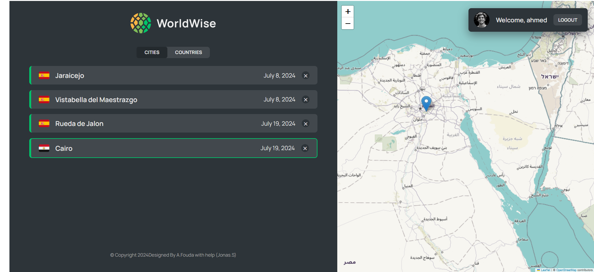

# World Wise

World Wise is a comprehensive web application that allows users to explore cities and countries. Users can add cities to their list, view details about the cities, and explore countries they've visited. The app utilizes React, React Router, and various hooks to manage state and handle side effects.

## Features

- **City and Country Management:** Add, view, and manage cities and countries.
- **City Details:** View detailed information about each city, including date visited and personal notes.
- **Map Integration:** Click on the map to add cities with geolocation data.
- **User Authentication:** Login to access personalized features.
- **Responsive Design:** Optimized for different screen sizes using CSS modules.
- **Lazy Loading:** Load components asynchronously for better performance.

## Technologies Used

- **Frontend:** React, React Router, CSS Modules, React Leaflet
- **State Management:** Context API, useReducer hook
- **APIs:** BigDataCloud API for reverse geocoding, Local server for city data
- **UI Components:** Custom Button, Form, and Spinner components

## Project Structure

- **Components:** Reusable UI components for city items, country items, forms, spinners, etc.
- **Pages:** Different pages like Home, Pricing, Product, Login, and a 404 Page.
- **Contexts:** Context providers for managing cities and user authentication.
- **Hooks:** Custom hooks for URL position and geolocation.

## Getting Started

1. Clone the repository:

   git clone https://github.com/your-username/city-explorer.git
   cd city-explorer

2. Install dependencies:

   npm install

3. Start the development server:

   npm run dev

4. start the server:
   npm run server

## Usage

- **Add a City:** Click on a location on the map to add a new city. Fill in the details and submit the form.
- **View City Details:** Click on a city in the list to view detailed information.
- **Manage Cities:** Delete cities from your list by clicking the delete button next to each city.
- **Explore Countries:** View a list of countries you have cities added in.

## Contributing

Contributions are welcome! Please fork the repository and create a pull request with your changes.

## scrennshots

## Acknowledgements

- **Ahmed Fouda:** create this project
- **Jonas Schmedtmann:** For inspiration and guidance.
- **React Community:** For the amazing resources and support.
